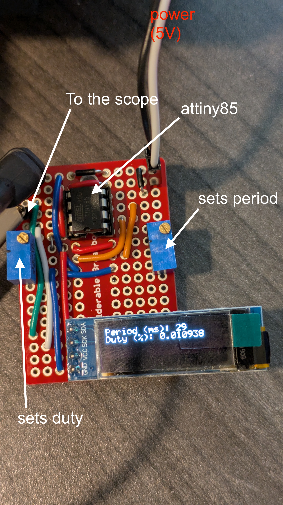
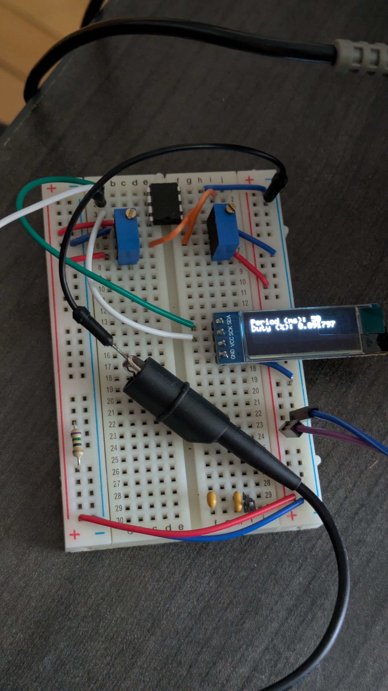
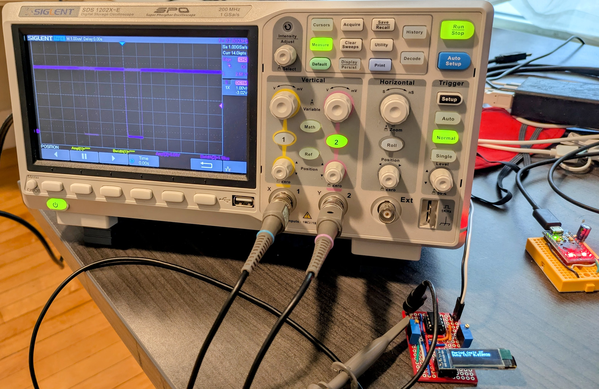

# Small pulser with an MCU

Author:  Areg Danagoulian.  
Date: 07.23.2025

This repository contains the arduino code for a small pulser operated by an attiny85 MCU.  The MCU reads in voltages from two potentiometers, and interprets them as duty factor and period. 

The code is located in `attiny85_pulser_variable`, and contains the descriptions. 

Given the simplicity of the circuit, we only add the pictures, with some description thereof.  You can also watch a brief video [here, describing the essence of the device and its operation](https://photos.app.goo.gl/evEdECPvbDPTum2H9). 

The picture below shows the layout of the circuit.

Of course you do not need to use a soldered breadboard, however a soldered PCB or breadboard produces a much cleaner signal.  Below is a layout on a regular breadboard:

Finally, here's the example of a trace on a scope:

